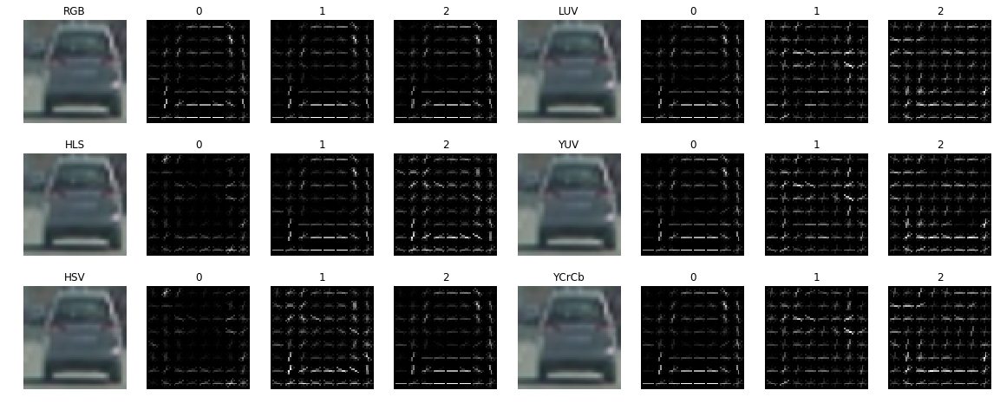
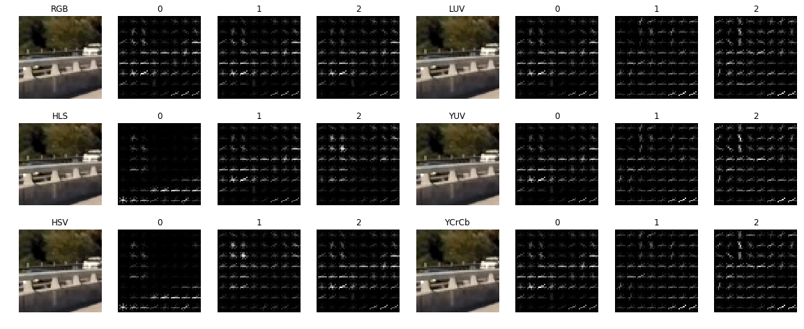
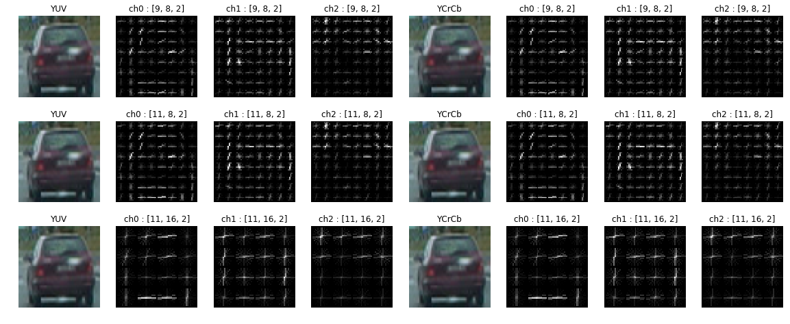
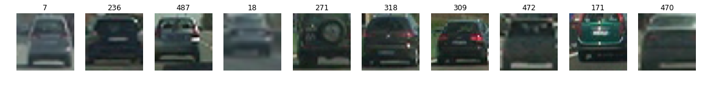
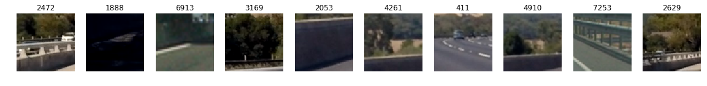
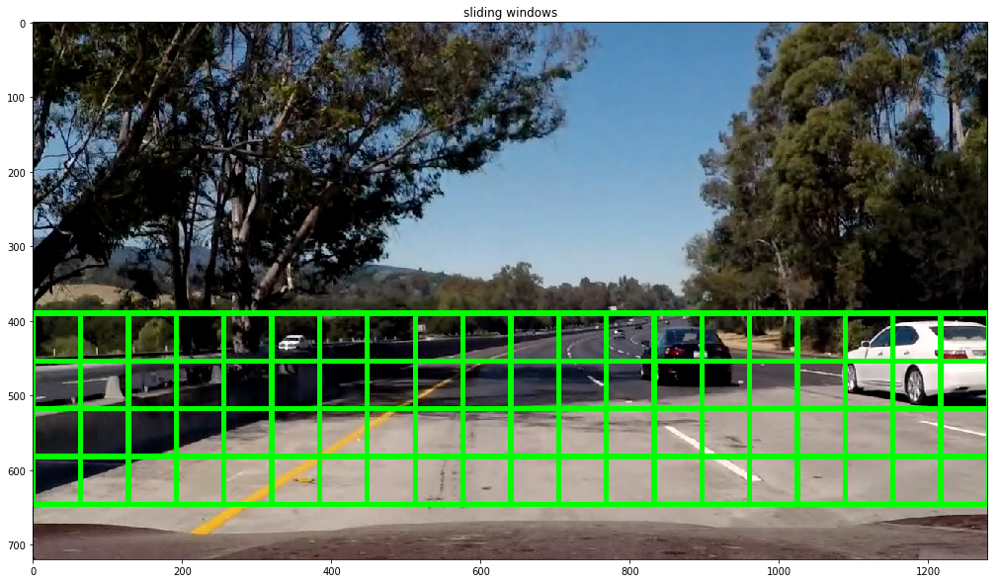
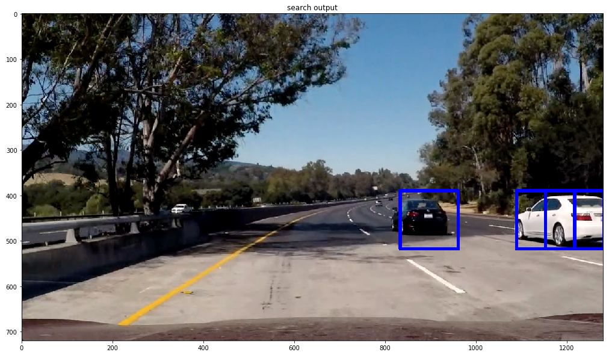
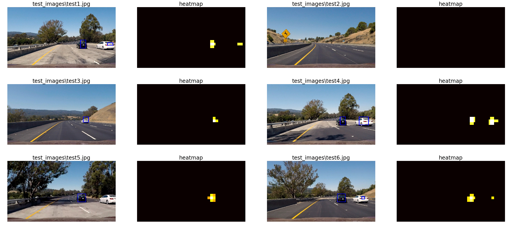

# **Vehicle Detection**

The goal of this project is to build an image processing pipeline using HOG classifier that detects other vehicles on the road. To start with, code from various assignments and quizzes was used. Further experimenting with it, final image processing pipeline was implemented. This document describes various steps used in the pipeline and the approach used.

## Histogram of Oriented Gradients

There are multiple color spaces, various HOG parameters to try with. Every combination has some different effect. Some are very accurate but not at all efficient, some are little less accurate but very fast. I had to try many such combinations.

### Selecting Color Space

To start with, there were total 6 different color spaces to consider - "RGB", "LUV", "HLS", "YUV", "HSV", "YCrCb". Every representation has its own pros and cons. Following image shows output of HOG applied on each color channel of different color spaces:

_Car Image:_

_Non-car Image:_

As you can see in the above image, in "RGB" color space, all channel relatively shar same information, whereas H-channel of "HSV" and "HLS" is not really useful. Compared to them, "LUV", "YUV" and "YCrCb" could extract more information.

### Selecting HOG Parameters

Important parameters in HOG are `orientation`, `pixel_per_cell` and `cell_per_block`. If orientation is increased, more features are extracted, but processing time is increased. Similarly, if pixel_per_cell and cell_per_block are changed, number of features changes. I tried following combinations of parameters:

### Training a Classifier

I used dataset provided by udacity. it has 8792 images of cars and 8968 images of non-cars. The dataset was randomly split into 80%-20% train and test dataset. Following image shows samples of both the car and non-car datasets:

_Car Image Samples:_

_Non-car Image Samples:_

Once images from dataset are read, features of each image are extracted appended to feature list. Function `extract_features()` extracts the features of all images in dataset and return a big list containing them. These features are then normalized using `StandardScaler()`. I trained linear SVM using extracted features. I decided to use only HOG features with "YUV" and "YCrCb" to experiment with since both the color spaces extract relatively more useful HOG features as compared to other color spaces. Following table summarizes output of various training tests performed:

| colorspace | channel | orient | pix/cell | cell/block | time-extract | num-features | time-train | train-accuracy | test-accuracy |
|:-----------|:--------|:-------|:---------|:-----------|:-------------|:-------------|:-----------|:---------------|:--------------|
| YUV        | 0       | 9      | 8        | 2          | 56.62        | 1764         | 8.52       | 0.9999         | 0.9479        |
| YUV        | 1       | 9      | 8        | 2          | 53.94        | 1764         | 10.78      | 0.9977         | 0.9248        |
| YUV        | 2       | 9      | 8        | 2          | 52.86        | 1764         | 20.91      | 0.9602         | 0.8958        |
| YUV        | ALL     | 9      | 8        | 2          | 115.3        | 5292         | 4.06       | 1.0            | 0.9845        |
| YUV        | 0       | 11     | 8        | 2          | 47.92        | 2156         | 8.72       | 0.9999         | 0.9527        |
| YUV        | 1       | 11     | 8        | 2          | 45.99        | 2156         | 10.99      | 0.9992         | 0.935         |
| YUV        | 2       | 11     | 8        | 2          | 44.22        | 2156         | 16.91      | 0.9927         | 0.906         |
| YUV        | ALL     | 11     | 8        | 2          | 108.37       | 6468         | 3.81       | 1.0            | 0.9879        |
| YUV        | 0       | 11     | 16       | 2          | 29.7         | 396          | 3.53       | 0.9758         | 0.9665        |
| YUV        | 1       | 11     | 16       | 2          | 30.39        | 396          | 5.48       | 0.9632         | 0.9561        |
| YUV        | 2       | 11     | 16       | 2          | 29.35        | 396          | 7.39       | 0.939          | 0.9389        |
| **YUV**    | **ALL** | **11** | **16**   | **2**      | **61.73**    | **1188**     | **2.01**   | **1.0**        | **0.987**     |
| YCrCb      | 0       | 9      | 8        | 2          | 45.92        | 1764         | 7.55       | 0.9999         | 0.9386        |
| YCrCb      | 1       | 9      | 8        | 2          | 54.48        | 1764         | 11.83      | 0.997          | 0.9262        |
| YCrCb      | 2       | 9      | 8        | 2          | 54.56        | 1764         | 15.33      | 0.9804         | 0.9136        |
| YCrCb      | ALL     | 9      | 8        | 2          | 127.88       | 5292         | 14.18      | 1.0            | 0.9837        |
| YCrCb      | 0       | 11     | 8        | 2          | 45.82        | 2156         | 9.11       | 1.0            | 0.9566        |
| YCrCb      | 1       | 11     | 8        | 2          | 45.97        | 2156         | 13.3       | 0.9997         | 0.924         |
| YCrCb      | 2       | 11     | 8        | 2          | 43.96        | 2156         | 13.76      | 0.9995         | 0.9209        |
| YCrCb      | ALL     | 11     | 8        | 2          | 105.37       | 6468         | 15.68      | 1.0            | 0.9834        |
| YCrCb      | 0       | 11     | 16       | 2          | 27.98        | 396          | 3.27       | 0.9749         | 0.9654        |
| YCrCb      | 1       | 11     | 16       | 2          | 27.64        | 396          | 5.85       | 0.9619         | 0.9488        |
| YCrCb      | 2       | 11     | 16       | 2          | 27.81        | 396          | 6.38       | 0.9445         | 0.9381        |
| **YCrCb**  | **ALL** | **11** | **16**   | **2**      | **59.41**    | **1188**     | **1.95**   | **1.0**        | **0.9876**    |

As you can see in the above table, "YUV" and "YCrCb" both have really good performance numbers with `orientation = 11`, `pix_per_cell = 16` and `cell_per_block = 2`. However, "YCrCb" is a little faster than "YUV", so, I decided to use "YCrCb" with above parameters as my final model for training.

## Sliding Window Search

Searching an object - another car - in the frame was very interesting. It is not efficient to search in entire frame as it is very time consuming. Most of the road and other vehicles appear in the lower half of the frame. So, I used sliding window in the lower half of the frame. Following section explains how I computed search windows.

### Multiscale Windows

After experimenting with test images, I divided lower screen into 3 different areas of interest and used 5 different scales to extract useful windows out of. After scaling, I used window of 64x64 with 50% overlap to search in the area of interest. Following figure shows different regions and sample search windows. 

Function `find_cars()` search through this each computed window and tries to predict for a car in the search window. If found, window coordinates are saved. Before searching in the window, input image is first converted to "YCrCb" color space and the after cropping and scaling it, HOG is computed. For prediction, this extracted HOG feature runs through the model. Following image show output after find_car() processes and spots cars in the frame:

### False Positives and Multiple Detections

Removing false positives and multiple detections was the most difficult part. I used heatmap for that. Threshold used for heatmap was dynamic. Highest magnitude in the heatmap is calculated and its half value is used as threshold. so, components below that threshold are discarded. Following image shows heat map for sample images:

## Video Implementation

Once the pipeline was tried on the test images, it war run through the video. After running the video, I noticed even more false positives. So, to handle this I kept track of past 10 frames and their detections. This past data was also used to calculate heatmap. Once frame is aged it was discarded. This helped smoother the detections. Following GIF shows snippet from the output video:

!!! final video gif

Since image data doesn't change from frame to frame, alternate frames were used for predictions. This helped improve performance and smoothen the search output.
Complete output video can be found here: [output_video.mp4](output_video.mp4)

## Challenges Faced / Further Improvements

The most interesting and challenging part of this project was creating right search windows and removing false positives while keeping the necessary information intact. As said above, I used heatmap, multiscale windows and history frames to improve performance of the video pipeline.

For further improvements, Frame class can be implemented that can keep track of past few valid detected frames and their measurements. This can help smoothen the output by eliminating incorrectly calculated measurements and would also help tracking the object.

